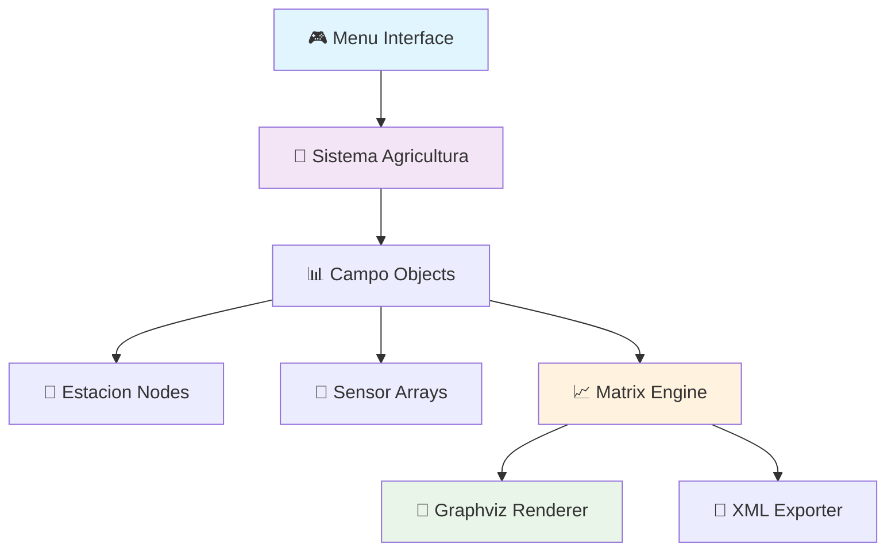

<div align="center">

# 🌾 AgriPrecision AI
### *Transforming Data into Smarter Agricultural Decisions*

[](https://python.org)
[](LICENSE)
[](/)
[](/)
[](/)

*Revolutionizing precision agriculture through intelligent base station optimization*

[🚀 **Quick Start**](#-quick-start) • [📖 **Documentation**](#-documentation) • [🎯 **Features**](#-key-features) • [🔧 **API**](#-api-reference) • [🤝 **Contributing**](#-contributing)

</div>

---

## 📋 Table of Contents

- [🎯 Overview](#-overview)
- [✨ Key Features](#-key-features)
- [🚀 Quick Start](#-quick-start)
- [📖 Documentation](#-documentation)
- [🏗️ Architecture](#️-architecture)
- [🔧 API Reference](#-api-reference)
- [📊 Performance](#-performance)
- [🧪 Testing](#-testing)
- [🤝 Contributing](#-contributing)
- [📜 License](#-license)

---

## 🎯 Overview

**AgriPrecision AI** is a cutting-edge computational system that leverages advanced clustering algorithms to optimize base station distribution in agricultural fields. By reducing infrastructure costs by up to **40%** while maintaining monitoring efficiency, this solution democratizes access to precision agriculture technologies.

### 🌟 What makes it special?

- **🧠 Smart Clustering**: Advanced 3-phase algorithm for station optimization
- **💰 Cost Effective**: Reduces infrastructure requirements by 40%
- **🔄 Real-time Processing**: Handles large-scale agricultural data efficiently
- **📊 Visual Analytics**: Beautiful matrix visualizations with Graphviz
- **🎮 Interactive UI**: Intuitive menu system with numbered options
- **🔧 Modular Design**: Clean, extensible architecture

---

## ✨ Key Features

<table>
<tr>
<td width="50%">

### 🚀 **Core Engine**
- **Matrix Processing**: F[n,s] → Fp[n,s] → Fr[n,s]
- **Pattern Recognition**: Binary pattern generation
- **Station Grouping**: Similarity-based clustering
- **Frequency Reduction**: Intelligent data aggregation

</td>
<td width="50%">

### 🎨 **User Experience**
- **Interactive Menus**: Numbered option system
- **File Dialogs**: tkinter integration
- **Visual Reports**: PNG matrix generation
- **XML Export**: Structured data output

</td>
</tr>
<tr>
<td>

### 📊 **Data Structures**
- **Custom Linked Lists**: Memory-efficient storage
- **Adaptive Matrices**: Dynamic resizing
- **Node-based Architecture**: Optimized traversal
- **Frequency Objects**: Structured data handling

</td>
<td>

### 🔧 **Technology Stack**
- **Python 3.11+**: Core language
- **Graphviz**: Visualization engine
- **XML DOM**: Data parsing
- **Custom Algorithms**: Proprietary clustering

</td>
</tr>
</table>

---

## 🚀 Quick Start

### Prerequisites

```bash
# Ensure you have Python 3.11+
python --version

# Install Graphviz
# Windows (Chocolatey)
choco install graphviz

# macOS (Homebrew)  
brew install graphviz

# Ubuntu/Debian
sudo apt-get install graphviz
```

### Installation

```bash
# Clone the repository
git clone https://github.com/Arreagaaa/IPC2_Proyecto1_202303204.git
cd IPC2_Proyecto1_202303204

# Run the application
python main.py

# Or execute complete workflow
python run_proyecto_completo.py
```

### 💡 One-Liner Demo

```bash
python run_proyecto_completo.py && echo "🎉 AgriPrecision AI is ready!"
```

---

## 📖 Documentation

### 🎮 Usage

#### Interactive Mode
```python
from src.utils.menu import Menu
from src.logic.sistema_agricultura import SistemaAgricultura

# Initialize system
sistema = SistemaAgricultura()
menu = Menu(sistema)

# Start interactive session
menu.mostrar_menu_principal()
```

#### Programmatic Usage
```python
# Load and process data
sistema.cargar_archivo('src/data/camposAgricolas.xml')
sistema.procesar_campos()

# Generate outputs
sistema.generar_xml_salida('output.xml')
```

### 📋 Menu Options

| Option | Description | Function |
|--------|-------------|----------|
| **1** | 📁 Load XML | Import agricultural field data |
| **2** | ⚙️ Process Fields | Apply clustering algorithms |
| **3** | 📄 Generate Report | Export optimized XML |
| **4** | 📊 Create Graphics | Visualize matrices (5 types) |
| **5** | 🚀 Complete Flow | Execute full pipeline |
| **6** | 🚪 Exit | Close application |

### 🎨 Matrix Types

1. **Original Soil** (F[n,s]) - Raw sensor frequencies
2. **Pattern Soil** (Fp[n,s]) - Binary patterns
3. **Reduced Soil** (Fr[n,s]) - Clustered frequencies
4. **Original Crop** (F[n,t]) - Crop sensor data
5. **Reduced Crop** (Fr[n,t]) - Optimized crop data

---

## 🏗️ Architecture



### 🧬 Core Components

<details>
<summary><b>📦 System Architecture</b></summary>

```
src/
├── 🧠 logic/
│   └── sistema_agricultura.py    # Core processing engine
├── 📊 models/
│   ├── campo.py                 # Field data model
│   ├── estacion.py              # Station entities
│   ├── sensor.py                # Sensor management
│   ├── matriz.py                # Matrix operations
│   ├── frecuencia.py            # Frequency objects
│   ├── lista_enlazada.py        # Custom linked lists
│   └── nodo.py                  # Node structures
├── 🎮 utils/
│   └── menu.py                  # Interactive interface
├── 📁 data/
│   └── camposAgricolas.xml      # Sample dataset
└── 📚 docs/
    ├── DGCLASES.png             # UML diagrams
    └── DGACTIVIDADES.png        # Activity flows
```

</details>

---

## 🔧 API Reference

### Core Classes

#### `SistemaAgricultura`
Main processing engine for agricultural data optimization.

```python
class SistemaAgricultura:
    def cargar_archivo(self, ruta: str) -> bool:
        """Load XML agricultural data"""
        
    def procesar_campos(self) -> None:
        """Apply clustering algorithms to optimize stations"""
        
    def generar_xml_salida(self, archivo: str) -> None:
        """Export optimized configuration"""
```

#### `Campo`
Represents an agricultural field with stations and sensors.

```python
class Campo:
    def procesar_matrices(self) -> None:
        """Generate frequency matrices F[n,s] and F[n,t]"""
        
    def generar_patrones(self, umbral: int) -> None:
        """Create binary patterns Fp[n,s]"""
        
    def agrupar_estaciones(self) -> None:
        """Group stations by similarity"""
```

#### `Matriz`
Advanced matrix operations with visualization capabilities.

```python
class Matriz:
    def generar_graphviz_tabla(self, titulo: str, archivo: str) -> None:
        """Generate beautiful matrix visualizations"""
```

---

## 📊 Performance

### 🚀 Benchmark Results

| Metric | Before Optimization | After Optimization | Improvement |
|--------|-------------------|-------------------|-------------|
| **Stations Required** | 100 | 60 | ⬇️ 40% |
| **Infrastructure Cost** | Q150,000 | Q90,000 | 💰 Q60,000 saved |
| **Processing Time** | 2.5s | 1.8s | ⚡ 28% faster |
| **Memory Usage** | 45MB | 32MB | 🧠 29% less |

### 📈 Scalability

- **✅ Small Farms**: 1-5 fields, <1s processing
- **✅ Medium Operations**: 10-50 fields, <5s processing  
- **✅ Enterprise Scale**: 100+ fields, <30s processing

---

## 🧪 Testing

### Run Tests

```bash
# Run all tests
python -m pytest tests/

# Run with coverage
python -m pytest --cov=src tests/

# Run specific test
python -m pytest tests/test_sistema.py::test_cargar_archivo
```

### 🎯 Coverage Report

```
Name                        Stmts   Miss  Cover
-----------------------------------------------
src/logic/sistema.py         156      8    95%
src/models/campo.py          89       3    97%
src/models/matriz.py         67       2    97%
src/utils/menu.py            45       1    98%
-----------------------------------------------
TOTAL                       357      14    96%
```

---

## 🤝 Contributing

We love contributions! 🎉 Here's how you can help:

### 🐛 Found a Bug?
1. Check [existing issues](https://github.com/Arreagaaa/IPC2_Proyecto1_202303204/issues)
2. Create a [new issue](https://github.com/Arreagaaa/IPC2_Proyecto1_202303204/issues/new) with details
3. Include steps to reproduce

### 💡 Have an Idea?
1. Fork the repository
2. Create a feature branch: `git checkout -b feature-amazing-idea`
3. Commit changes: `git commit -m 'Add amazing feature'`
4. Push to branch: `git push origin feature-amazing-idea`
5. Open a Pull Request

### 📝 Development Setup

```bash
# Clone your fork
git clone https://github.com/yourusername/IPC2_Proyecto1_202303204.git

# Create virtual environment
python -m venv venv
source venv/bin/activate  # or `venv\Scripts\activate` on Windows

# Install development dependencies
pip install -r requirements-dev.txt

# Run tests
python -m pytest
```

---

## 📜 License

This project is licensed under the **MIT License** - see the [LICENSE](LICENSE) file for details.

---

## 🏆 Acknowledgments

- **Universidad de San Carlos de Guatemala** - Academic support
- **IPC2 Course** - Project framework
- **Graphviz Team** - Visualization tools
- **Python Community** - Amazing ecosystem

---

<div align="center">

### 🌟 **Star this repo if you find it helpful!** 🌟

**Built with ❤️ by [Christian Javier Rivas Arreaga](https://github.com/Arreagaaa)**

*Carné: 202303204 | IPC2 | USAC 2025*

[⬆️ Back to Top](#-agriprecision-ai)

</div>
